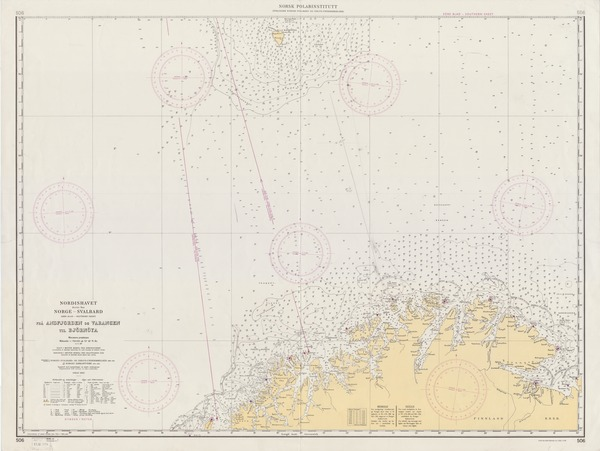

# Usage
See: https://material.angularjs.org/latest/#/demo/material.components.gridList

Wrap grid-list in

    <md-content layout-padding class="np-layout-grid"></md-content>

Wrap images in

    

E.g.

    <md-grid-tile md-colspan-gt-sm="1" md-rowspan-gt-sm="1">
      

        
      

      <md-grid-tile-footer>
        <h3>Nordishavet</h3>
      </md-grid-tile-footer>
    </md-grid-tile>
